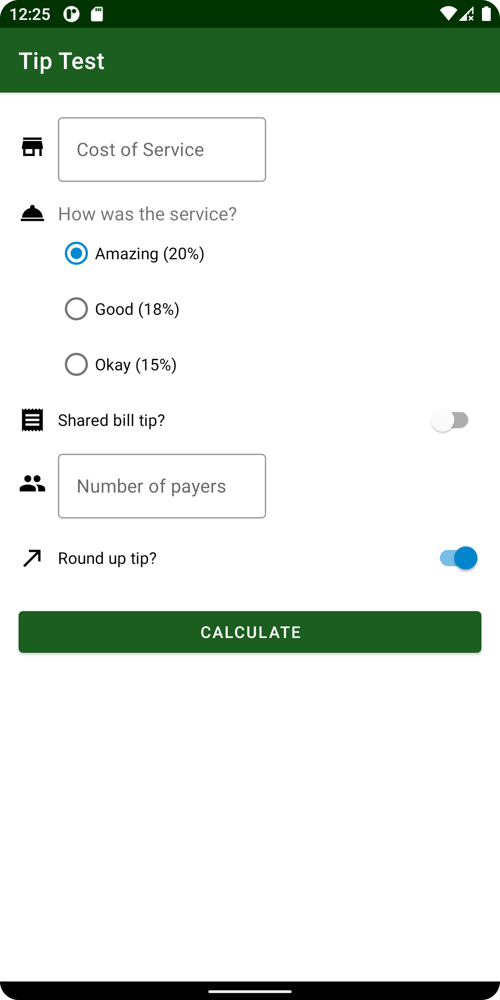

<h1> TipCalculator </h1>

A simple tip calulator app for Android

## What does this app do?

The Tip Calculator calculates tip amount for three most-used percentages (based on the service's quality) of the  cost of the service, and also provides a total amount that includes the  tip.

This app provides a quick way to calculate your tip with a simple design and straightforward user interface.

### Features:

+ Total tip amount
+ Total cost that includes the tip
+ Shared bill supported
  + Tip per person
  + Total cost per person

## Compatibility

+ The Tip Calculator requires at least Android 5 Lollipop.

+ This app will work properly on devices without any Google service installed.
